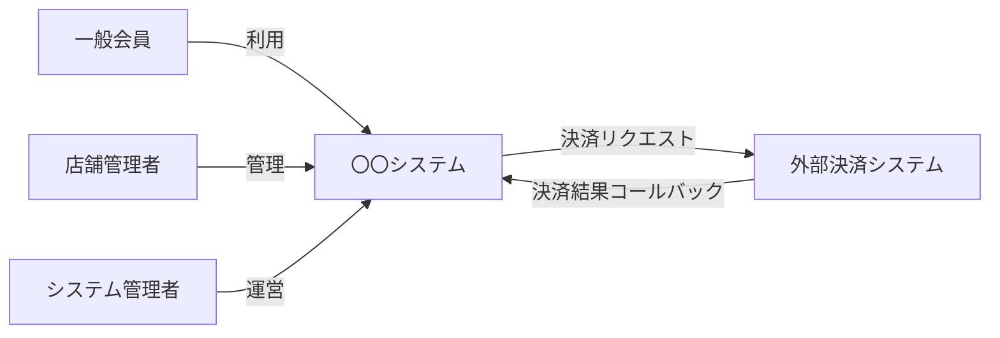

# アクター定義書

## 概要

本書は、〇〇システムに関わるすべてのアクターを定義する。
ここで定義したアクター名は、システム全体の成果物（機能一覧・画面遷移図・インタフェース一覧など）で統一して使用する。

---

## アクター一覧

| アクターID | アクター名 | 種別 | 概要 |
|---|---|---|---|
| A-001 | （例）一般会員 | 人間 | 〇〇サービスを利用するエンドユーザー |
| A-002 | （例）店舗管理者 | 人間 | 自店舗のデータを管理する担当者 |
| A-003 | （例）システム管理者 | 人間 | システム全体の設定・ユーザー管理を行う運営担当者 |
| A-004 | （例）外部決済システム | 外部システム | 決済処理を担う外部サービス |

---

## アクター詳細

### A-001 一般会員

〇〇サービスを利用するエンドユーザー。会員登録後に利用可能。

- **認証方法**: メールアドレス＋パスワード / SNSログイン
- **利用環境**: Webブラウザ（PC・モバイル）

**できること（許可）**
- 自分のプロフィール参照・編集
- 商品の検索・閲覧
- 注文・購入
- 注文履歴の参照

**できないこと（禁止）**
- 他会員の情報参照
- 商品マスタの編集
- 管理画面へのアクセス

---

### A-002 店舗管理者

自店舗に紐づく商品・注文・スタッフを管理する担当者。

- **認証方法**: メールアドレス＋パスワード（管理画面）
- **利用環境**: Webブラウザ（PC）

**できること（許可）**
- 自店舗の商品登録・編集・削除
- 自店舗への注文の確認・ステータス更新
- 自店舗のスタッフアカウント管理

**できないこと（禁止）**
- 他店舗のデータへのアクセス
- システム全体の設定変更
- 会員の個人情報の一括取得

---

### A-003 システム管理者

システム全体の設定・マスタデータ・ユーザー管理を担当する運営担当者。

- **認証方法**: メールアドレス＋パスワード＋多要素認証（MFA）
- **利用環境**: Webブラウザ（PC）

**できること（許可）**
- すべての店舗・会員・注文データの参照
- マスタデータの管理
- ユーザー（店舗管理者・スタッフ）アカウントの作成・停止・削除
- システム設定の変更

**できないこと（禁止）**
- 会員パスワードの平文参照

---

### A-004 外部決済システム

購入処理時に決済を実行する外部サービス。

- **認証方法**: APIキー
- **利用環境**: サーバー間通信（HTTPS）

**できること（許可）**
- 決済リクエストの受信・処理
- 決済結果のコールバック送信

**できないこと（禁止）**
- 決済情報以外のデータへのアクセス

---

## アクター間の関係

